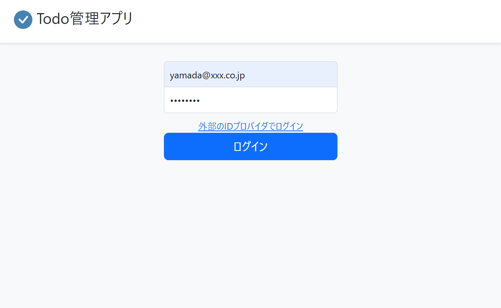
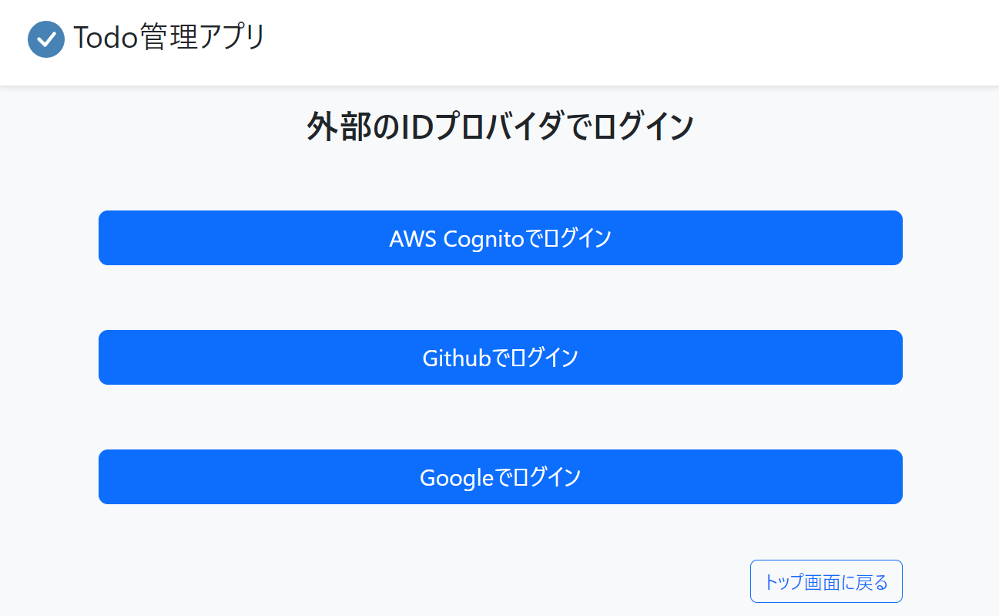
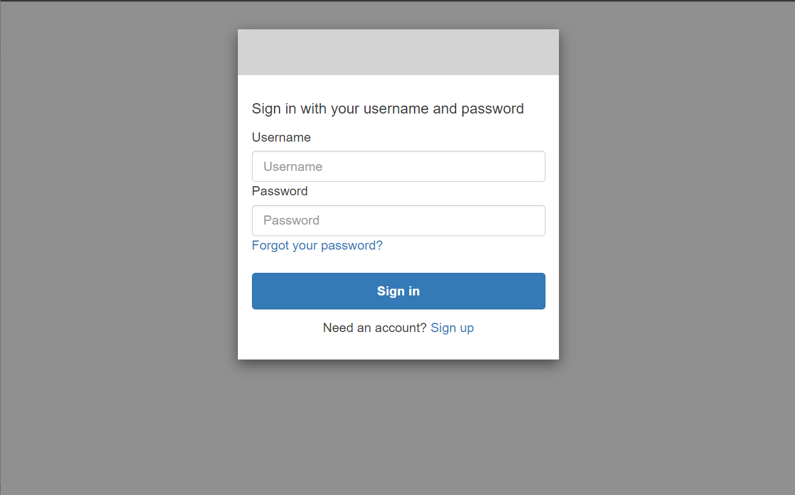
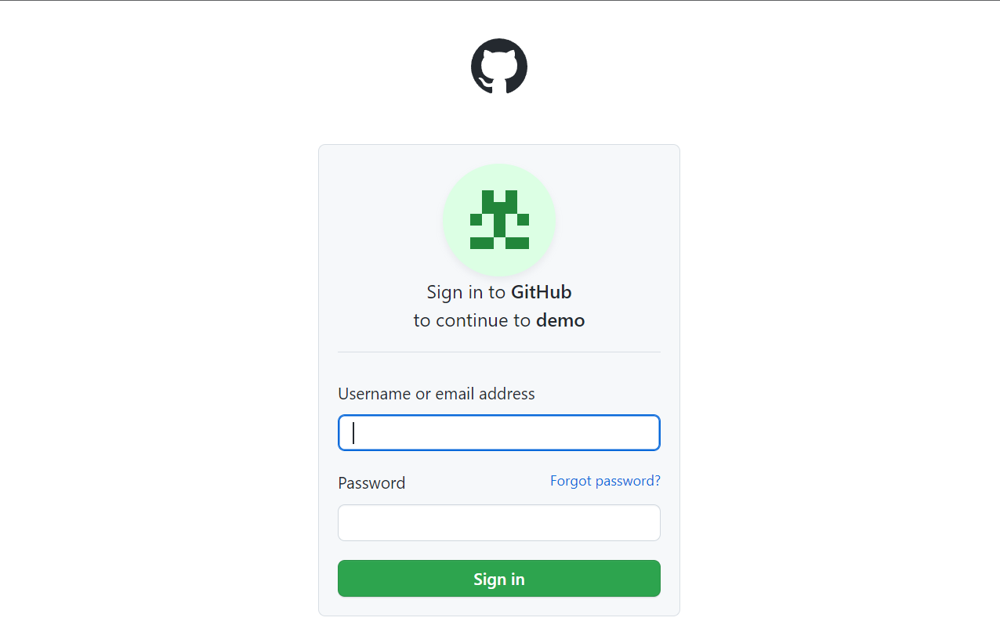
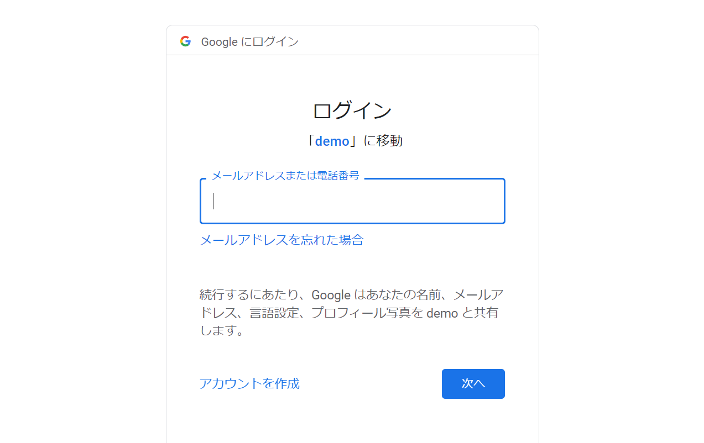

# SpringBoot/Spring Security OAuth2.0のユーザ認証のアプリケーションのサンプル

## サンプル概要
* SpringSecurityの機能を用いたログイン処理のサンプルアプリケーションである。Form認証と、OAuth2.0ログイン(OIDC)の両方が使えるようになっている。
* Form認証は、RDBのユーザテーブルのデータを用いてログインできる。
    * 
* 「外部のIDプロバイダでログイン」を選択すると、以下のIdPを選択し、OAuth2.0ログイン(OIDC)が可能となっている。

    * Cognito
        
    * GitHub
        
    * Google
        

## Cognito環境の構築
* AWS Management Consoleから、以下の設定で、ユーザプールを作成
    * Cognito ユーザープールのサインインオプション: 「ユーザ名」にチェック
    * パスワードポリシー: デフォルト
    * 多要素認証: MFAなし
    * ユーザアカウントの復旧: デフォルト
    * サインアップエクスペリエンスを設定のページ: 全般デフォルトで、最後の「カスタム属性 -オプション」に以下を追加
        * 名前: isAdmin
        * タイプ: Number
        * 最小: 0
        * 最大: 1
    * Eメールプロバイダ: CognitoでEメールを送信
    * ユーザプール名: TestUserPool
    * ホストされた認証ページ: 「CognitoのホストされたUIを使用」にチェック
    * ドメイン
        * Cognitoドメインを使用する
        * ドメインプレフィックスを以下に設定
            * https://authenticate-springboot-application
    * 最初のアプリケーションクライアント
        * アプリケーションタイプ: 秘密クライアント
        * アプリケーションクライアント名: sample-springsecurity-cognito
        * クライアントのシークレット: クライアントのシークレットを生成する
        * 許可されているコールバックURL: http://localhost:8080/login/oauth2/code/cognito
        * 高度なアプリケーションクライアントの設定:　全般デフォルトで、OpenID接続スコープに「プロファイル」をチェック
* 作成したユーザプールので、ユーザの作成
    * ユーザ名: 任意のユーザ名 
    * Eメールアドレス: 任意のメールアドレス 
    * 仮パスワード: 任意のパスワード   
* ユーザ作成後、ユーザ属性を追加
    * オプションの属性: 「custom:isAdmin」を値「1」で作成
        * Cognitoの場合は、サンプルAPで、custom:isAdminというカスタム属性の値にもとづきロールを設定する実装をしている。
        * custom:isAdminを値1で作成すると、SpringSecurityの管理者ユーザ（ROLE_ADMIN）扱い、値0で作成すると一般ユーザ扱いとなる。

## GitHubのセットアップ
* GitHubアカウントを作成
* GitHubのOAuth2.0認証システムを使用するため、[GitHubのDevelopper settingのページ](https://github.com/settings/developers)で、「New OAuth App」をクリックして、アプリを追加する。    
    * Application name:任意の文字列
    * Home Page URL: http://localhost:8080/
    * Authorization callback URL: http://localhost:8080/login/oauth2/code/github

## Google APIのセットアップ
* Googleアカウントを作成
* [Google API Console](https://console.developers.google.com/)で、「OAuth同意画面」を作成。
* [Google API Console](https://console.developers.google.com/)で、「認証情報」で「＋認証情報を作成」から「OAuth 2.0 クライアントID」を作成
    * アプリケーションの種類: ウェブアプリケーション
    * 名前:任意の文字列
    * 承認済みのリダイレクトURI: http://localhost:8080/login/oauth2/code/google

    
## application.ymlの設定
* Cognitoの設定を修正
    * issuerUriに、Cognitoのリージョン、ユーザプールIDを設定
        * https://cognito-idp.{region}.amazonaws.com/{Pool Id}
    * client-idに生成されたクライアントIDを設定
    * client-secretに生成されたクライアントシークレットを設定
* Githubの設定を修正
    * client-idに生成されたクライアントIDを設定
    * client-secretに生成されたクライアントシークレットを設定
* Googleの設定を修正
    * client-idに生成されたクライアントIDを設定
    * client-secretに生成されたクライアントシークレットを設定
## アプリケーション起動
* SpringBootのアプリケーションを起動し、http://localhost:8080 にアクセス
* 「Log in with AWS Cognito」のボタンをクリックするとCognitoの認証画面へ遷移
* ログインに成功すると、アプリケーションの画面に戻ってきてユーザ名、メールアドレスを表示

## 参考ページ
* https://spring.pleiades.io/guides/tutorials/spring-boot-oauth2/
* https://www.appsdeveloperblog.com/user-authentication-with-aws-cognito-in-spring-boot-application/
* https://www.baeldung.com/spring-security-oauth-cognito
* https://rieckpil.de/thymeleaf-oauth2-login-with-spring-security-and-aws-cognito/    

    